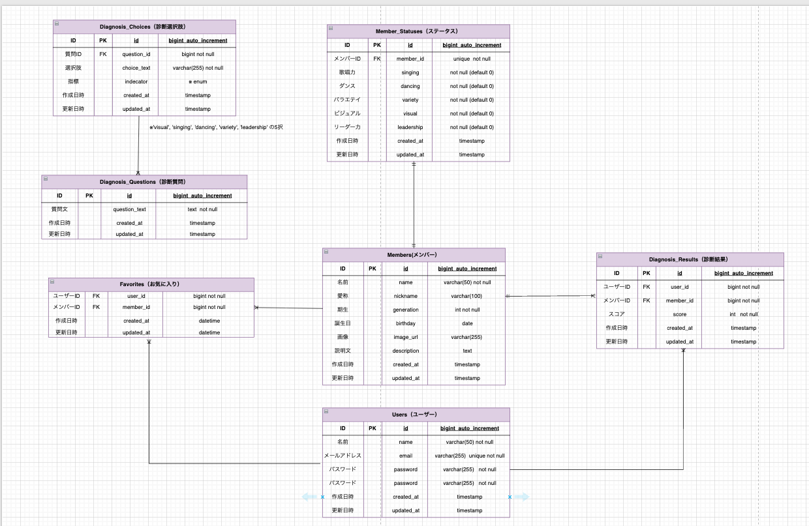

# N46-Remake

## URL
```bash
https://n46-remake.vercel.app/
```

## サービス概要
乃木坂の推しメンを紹介するサービス

## 機能一覧
- トップページ
- メンバー一覧
- 推しメン詳細（ステータス）
- 推し診断
- お気に入り

## 技術スタック（予定）
フロントエンド
```
Next.js 
TypeScript 
React
```
バックエンド
```
PHP 
Laravel
```

インフラ　
```
フロントエンド
Vercel

バックエンド
Render
```

## ER図概要



本アプリは「推しメン紹介・診断・お気に入り機能」を持つWebアプリケーションです。 
主なテーブル構成とリレーションは以下の通りです。

---

### ■ members（メンバー）

メンバーの基本情報を管理するテーブル。

- 1対1で `member_statuses` と紐づく
- 多対多で `users` と紐づく（favorites経由）
- 1対多で `diagnosis_results` と紐づく

---

### ■ member_statuses（ステータス）

メンバーの能力値（歌唱力・ダンスなど）を管理するテーブル。

- `members` と1対1の関係
- `member_id` に UNIQUE 制約を設定

---

### ■ users（ユーザー）

アプリ利用ユーザーを管理するテーブル。

- 多対多で `members` と紐づく（favorites経由）
- 1対多で `diagnosis_results` と紐づく

---

### ■ favorites（お気に入り）

ユーザーとメンバーの中間テーブル。

- `users` と `members` を多対多で接続
- `(user_id, member_id)` に UNIQUE 制約を設定し二重登録を防止

---

### ■ diagnosis_questions（診断質問）

推し診断に使用する質問を管理するテーブル。

- 1対多で `diagnosis_choices` と紐づく

---

### ■ diagnosis_choices（診断選択肢）

各質問の選択肢を管理するテーブル。

- `diagnosis_questions` と1対多の関係

---

### ■ diagnosis_results（診断結果）

診断結果の履歴を保存するテーブル。

- `users` と1対多の関係
- `members` と1対多の関係
- 診断スコアを保存

---

## リレーションまとめ

- members ↔ member_statuses ：1対1
- users ↔ members ：多対多（favorites経由）
- diagnosis_questions → diagnosis_choices ：1対多
- users → diagnosis_results ：1対多
- members → diagnosis_results ：1対多

---

## 設計方針

- 主キーは将来の拡張を考慮し `bigint` を採用
- 不要な冗長性を排除し第3正規形を意識
- 多対多は中間テーブルで管理
- 診断履歴を保持することで分析や拡張が可能な設計

# Docker × Laravel コマンド一覧

backendディレクトリに移動
```bash
cd backend
```

---

##  コンテナ関連

### 起動（バックグラウンド）
```bash
docker compose up -d
```

###  停止
```bash
docker compose down
```

###  再ビルド（Dockerfile変更時）

```bash
docker compose up -d --build
```

### コンテナ状態確認

```bash
docker compose ps
```

### DBボリュームも含めて完全削除(DBデータも削除されます)

```bash
docker compose down -v
```


### コンテナ内に入る

```bash
docker compose exec app bash
```


## Migration関連

### マイグレーション実行
```bash
docker compose exec app php artisan migrate
```

### 全削除して再作成
```bash
docker compose exec app php artisan migrate:fresh
```

### ロールバック（1つ戻す）
```bash
docker compose exec app php artisan migrate:rollback
```

## Seeder関連

### Seederを実行する
```bash
docker compose exec app php artisan db:seed
```

### マイグレーションをリセットして再投入する場合
```bash
docker compose exec app php artisan migrate:fresh --seed
```

### データ確認（Tinker）
```bash
docker compose exec app php artisan tinker

App\Models\Member::all();
```

## Model関連

### Model + Migration 作成

```bash
docker compose exec app php artisan make:model Model名 -m
```

### Model + Migration + Controller

```bash
docker compose exec app php artisan make:model Model名 -mcr
```


## Controller関連

### API Controller作成

```bash
docker compose exec app php artisan make:controller Controller名 --api
```


## キャッシュ関連

### 設定キャッシュ削除
```bash
docker compose exec app php artisan config:clear
```

### キャッシュ削除

```bash
docker compose exec app php artisan cache:clear
```

### ルートキャッシュ削除

```bash
docker compose exec app php artisan route:clear
```


### アクセスURL

```bash
http://localhost:8000
```


### Docker環境用 .env 設定

```bash
DB_CONNECTION=mysql
DB_HOST=db
DB_PORT=3306
DB_DATABASE=app_db
DB_USERNAME=root
DB_PASSWORD=password

※ localhost は使用しない（Dockerではサービス名 db を指定する）
```


## 開発フロー例

```bash
docker compose up -d
docker compose exec app php artisan migrate
docker compose exec app php artisan make:model Member -mcr
```

## Next.js コマンド一覧

frontendディレクトリに移動
```bash
cd frontend
```

### 起動コマンド
```
cd frontend
npm run dev
```

### アクセスURL

```bash
http://localhost:3000
```
